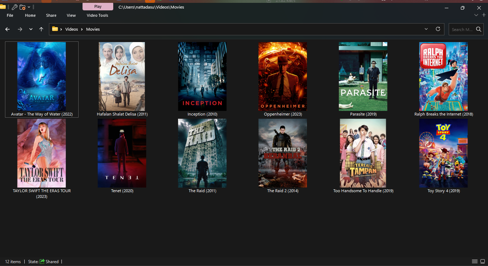
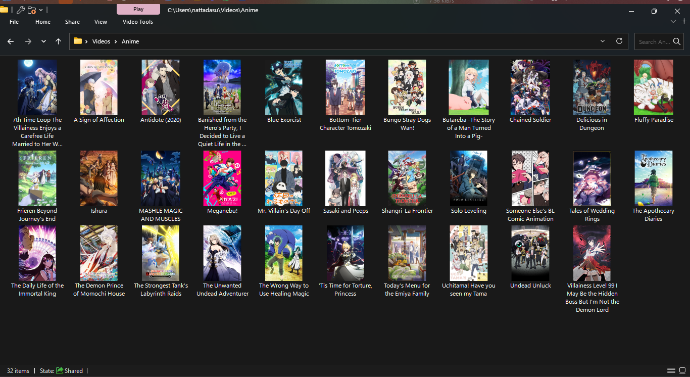

# Icon Creator

*Automatically create and set folder icons from media poster!*

> [!NOTE]
>
> This script may require using other media center software like Jellyfin or
> tinyMediaManager to download images for your media. Please read the
> requirements section below for more information.

## Motivation

We know that media center software like Jellyfin and Plex can automatically
manage your media library, HOWEVER, it only applies to the software itself. The
media folders on a file manager (Explorer, Finder, etc) are still left untouched
and you have to manually set the folder icons yourself, which can be confusing
and tedious for someone that requires some visual aids to navigate through their
media library.

It also a result of author's rant on another related project [Movies-Icon-Changer][mic],
which to be honest, it is a nice program with minimal UI. But, not only it is
Windows-only or adding unnecessary "dvdbox" as poster folder frame (trust me,
simplicity is the best), it also requires you to primarily use tinyMediaManager
to download images and metadata of the media, which is not ideal for someone that
wants to use other media center software like Jellyfin.

[mic]: https://github.com/DrAliRagab/Movies-Icon-Changer

## Requirements

* Python 3.10+
* [Jellyfin](https://jellyfin.org/) or [tinyMediaManager](https://www.tinymediamanager.org/)
  or any other media center software that can automatically download images assets
  for syour media.
  * Image assets for your media (e.g. posters, backgrounds, etc.) have to be
    downloaded and stored in the same directory as your media before running the
    script.
    * On Jellyfin, make sure to enable the option to download images in the
      server settings. This feature unfortunately only works if you added
      a new entry (movie/show) after enabling the option.
  * The script will automatically use/pick `folder.jpg` or `poster.jpg` as the
    icon for your media.
* [ImageMagick](https://imagemagick.org/index.php)
* No other python packages are required! Which the script itself is really
  portable.

## Usage

0. Install the requirements listed above.
1. Download the script and place it somewhere on your system. `~/Downloads` is
   an okay place.
   * Open following link and save the page as `generateicons.py`:
     https://raw.githubusercontent.com/nattadasu/mediascripts/main/iconcreator/generateicons.py
2. Check ImageMagick PATH by running `magick -version` in your terminal. If it
   doesn't work, you may need to add it to your PATH.
   * On Windows, check if `ImageMagick-*` folder exists in `C:\Program Files`.
   * If exist, modify path on the script to point to the `magick.exe` file on
     line 13
   * For example, if the path is `C:\Program Files\ImageMagick-7.1.0-Q16-HDRI`,
     then the path to `magick.exe` is:

     ```py
     magick_path: str = os.path.join("C:", "Program Files", "ImageMagick-7.1.0-Q16-HDRI", "magick.exe")
     ```

3. Open terminal/command prompt and run the script with the path to your media
   folder as the argument.
   * For example, if your script is located in `~/Downloads/generateicons.py`,
     then you would run:

     ```sh
     python ~/Downloads/generateicons.py
     ```

     or in Windows:

     ```bat
     python C:\Users\Username\Downloads\generateicons.py
     ```

     * If you have multiple Python versions installed, you may need to use
       `python3` instead of `python`. Or in Windows, you may need to use
       `py -3` instead of `python`.

4. The script will ask you the path to your media folder. Enter the path and
   press enter.
   * On Windows, you may find the path is "invalid" and exits the script. You
     can fix this by either replacing all `\` with `\\`, or replacing `\` with
     `/`
5. Wait for the script to finish. It will automatically create and set icons for
   your media folders.
6. Enjoy!

## Example

### Movies



### Anime



## Known Issues

* Due to limitations on Windows, folders with the poster image as the icon will
  set to read-only. In order to fix this, you have to manually remove the
  read-only attribute on the folder via properties. Note that this will also
  "reset" the icon to the default folder icon.
* The script is completely untested on *nix (GNOME or GTK-based DE, KDE, LXDE,
  LXQT) and especially on macOS with Finder. If you encounter any issues, please
  open an issue on GitHub.
* This script **will not ever** be published as a package on PyPI or run as an
  executable as this script only intended to be single-use and portable.

## Disclaimer

THIS SCRIPT MAY POTENTIALLY MODIFY OR DELETE YOUR FILES AND CHANGES YOUR MEDIA
FOLDER ATTRIBUTES. USE AT YOUR OWN RISK. NO WARRANTY AND SUPPORT WILL BE
PROVIDED FOR THIS SCRIPT REGARDLESS OF THE SITUATION.

## Fun Rant

Bruh, why in Windows as a lot of limitations? I mean, I know that Windows is
notorious for its limitations, but why? Why can't I just set the folder icon
without having to set the read-only attribute? Why can't I just set the folder
icon without having to use a third-party software to automatically set the
folder icon?

Really Microsoft, why? 🤨
